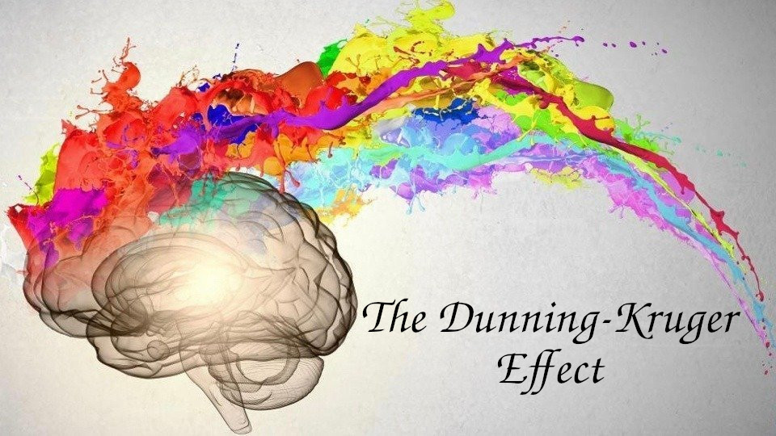
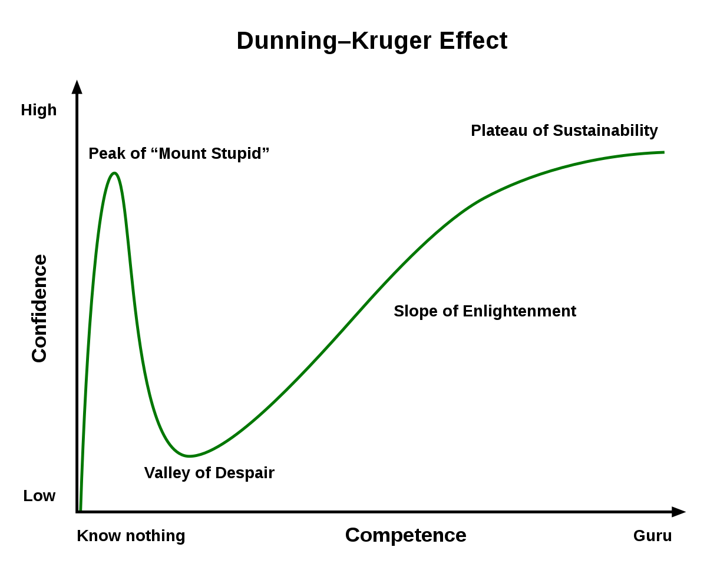

*Do we actually know how much we think we know things...?* 

  

I still remember attending the interview for my internship. They asked me "From the scale of 1 to10, how would you like to rate your python programming language skill?" -- "7.5" was my answer.  I can't stop laughing everytime that moment jogs my memory . After working few years in the particular field, I knew how vast that field was, and now if you asked me, my answer would be a 4 :sweat_smile: .

Am I going backwards?, is my expertise decreasing as I gain more experience?. -- Absolutely not. It is that I had overestimated my level before, but got to know later that it actually was significantly lower. Before, I just knew a small portion related to the field but after experiencing wilderness of the domain, I realised that the knowledge I possessed was considerably smaller. So, why did I feel like I had an imposing ability in python? -- Because of the Dunning-Kruger effect.

Indeed, sometimes we don't know exactly about our level of competency and as a human being, we are pretty bad at evaluating such things precisely. 

According to a research done by two social psychologists [David Dunning](https://en.wikipedia.org/wiki/David_Dunning) and [Justin Kruger](https://en.wikipedia.org/wiki/Justin_Kruger) in 1999, the people who are bad at particular things, significantly rated themselves higher up in the scale. This behaviour of overestimating thing is common among humans.  The interesting fact is that the people with the lowest ability to perform a task are more likely to rate their skills highly. As reported by a [survey](https://www.jstor.org/stable/2393221?seq=1), 32% of employee of company A and 42% of employee of company B estimated their performance as top 5% of the company's staffs. This cannot be statistically valid because 42% of people cannot be inside a 5%'s domain. Hmmm..., 42% percent of people thought they belong to the top 5% of the well performing employees -- interesting, isn't it?. 

  

Let's go briefly through this graph. At the time you know nothing, your confidence level is low. You start to learn things and just when you pass that point in life where you feel like you know a lot, unrealisingly, you are in a peak of "Mount Stupid" zone. The more you learn, the more you realise that the knowledge you have is nothing compared to the huge domain it falls under. You suddenly realise that you do not know anything, swinging by the narrow thought you enter the "valley of despair" where the awekening happens. The path of enlightment starts here and goes up to a point where you can sustain, knowing you do not know anything. Yes, we do not know anything.

  

The more we learn and gain experience, the more we maneuver towards idiocy until one day when we realise the stupidity of our mind. That is where our valley of despair lies. We have to infiltrate the so called "valley" to pass through it and climb the mountain where there is the sustainabily, if we reach the peak. The actions we take might be different if we know what phenomena we are going through. Now we know this, and yet we do not know anything.